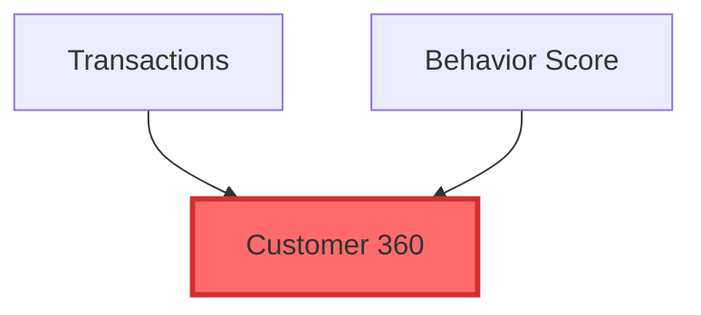

# ViewMapper - Architecture & Design Document

## Project Overview

**ViewMapper** is an intelligent Trino schema exploration tool that helps users navigate complex database schemas with thousands of views. It uses an LLM agent to provide guided exploration, preventing information overload by intelligently scoping diagrams and suggesting meaningful entry points.

**Key Value Proposition:** Unlike simple dependency mappers, ViewMapper acts as an intelligent guide that:
- Maps view dependencies based on SQL table/view references (not foreign keys)
- Assesses schema complexity before attempting visualization
- Suggests optimal starting points based on graph analysis
- Enables progressive disclosure through iterative exploration
- Generates focused, navigable dependency diagrams

## Critical Design Decisions

### 1. Java CLI + Python MCP Wrapper (Not Microservice)

**Decision:** Implement core logic as Java CLI, wrapped by lightweight Python MCP server.

**Rationale:**
- **Security:** No open ports, no network attack surface
- **Simplicity:** Single process model, easier installation
- **Portability:** JAR file + Python script = minimal dependencies
- **Testability:** Can test Java CLI independently via command line

**Architecture:**
```
┌──────────────────┐
│  Claude Desktop  │
└────────┬─────────┘
         │ stdio (JSON-RPC)
         ↓
┌──────────────────┐
│  Python MCP      │  ← ~40 lines, MCP protocol handling
│  Server          │
└────────┬─────────┘
         │ subprocess
         ↓
┌──────────────────┐
│  Java CLI        │  ← Core logic: LangChain4j + Trino parser
│  (viewmapper)    │  ← Accepts JSON args, outputs JSON results
└──────────────────┘
```

### 2. Trino SQL Parser (Not Regex)

**Decision:** Use Trino's native SQL parser for dependency extraction.

**Critical Rationale:**
- Regex CANNOT handle: CTEs, subqueries, UNNEST, quoted identifiers, string literals
- False positives/negatives compound in large graphs (2,347 views = hundreds of errors)
- Dependency accuracy is MISSION-CRITICAL for the entire value proposition
- Trino parser is authoritative source of truth for Trino SQL

**Example of regex failure:**
```sql
WITH temp AS (
  SELECT * FROM schema1.table1
  WHERE description LIKE '%schema2.fake_table%'  -- Regex catches this!
)
SELECT * FROM temp
JOIN schema3.table2 ON temp.id = table2.id
```
- Regex returns: `[schema1.table1, schema2.fake_table, temp, schema3.table2]` ❌
- Trino parser returns: `[schema1.table1, schema3.table2]` ✅

### 3. LangChain4j Agent (Not Simple Tool Calling)

**Decision:** Use LangChain4j with agentic reasoning, not just API calls.

**Why Agent vs. Simple Tool:**
The agent provides intelligent guidance through multi-step reasoning:

1. **Complexity Assessment**
   - Analyzes schema size before attempting visualization
   - Decides if full diagram is feasible or guidance is needed

2. **Entry Point Suggestion**
   - Identifies high-impact views (most dependents)
   - Finds leaf views (final outputs/reports)
   - Locates central hubs (high betweenness centrality)

3. **Progressive Disclosure**
   - Extracts focused subgraphs based on user selections
   - Checks if subgraph is still too large
   - Suggests depth adjustments or alternative focuses

4. **Context Retention**
   - Maintains exploration state across turns
   - Enables coherent multi-turn conversations

**Agent Reasoning Flow:**
```
User: "Show me viewzoo.example schema"
  ↓
Agent: [Calls AnalyzeSchema tool]
  → Result: 2,347 views, VERY_COMPLEX
  ↓
Agent: [Recognizes too large, calls SuggestEntryPoints]
  → Result: customer_360_view (326 dependents), ...
  ↓
Agent: [Responds with suggestions]

User: "Focus on customer_360_view"
  ↓
Agent: [Calls ExtractSubgraph with depth=2 upstream, 1 downstream]
  → Result: 45 nodes
  ↓
Agent: [Checks if manageable, calls GenerateMermaid]
  → Returns diagram
```

## Technology Stack

### Java Components
- **Language:** Java 21
- **CLI Framework:** Picocli (command-line argument parsing)
- **LLM Framework:** LangChain4j 0.35.0+ with Anthropic integration
- **SQL Parser:** Trino Parser 437+
- **Database Client:** Trino JDBC 437+
- **JSON:** Jackson 2.16+
- **Graph Analysis:** JGraphT or NetworkX-style algorithms
- **Build Tool:** Maven with Shade plugin (fat JAR)

### Python Components
- **MCP SDK:** `mcp` package (official Anthropic SDK)
- **Python Version:** 3.10+
- **Package Manager:** `uv` (modern, fast)

## Project Structure

```
viewmapper/
├── agent/
│   ├── pom.xml
│   └── src/main/java/com/github/robfromboulder/viewmapper/
│       ├── Main.java                          # CLI entry point (Picocli)
│       ├── cli/
│       │   └── ExplorationCommand.java        # Command definitions
│       ├── service/
│       │   ├── SchemaExplorationService.java  # Orchestration
│       │   └── DependencyAnalyzer.java        # Graph analysis
│       ├── parser/
│       │   ├── TrinoSqlParser.java            # Wraps Trino parser
│       │   └── DependencyExtractor.java       # AST visitor
│       ├── agent/
│       │   ├── LangChainAgent.java            # LangChain4j setup
│       │   └── tools/
│       │       ├── AnalyzeSchemaToolExecutor.java
│       │       ├── SuggestEntryPointsToolExecutor.java
│       │       ├── ExtractSubgraphToolExecutor.java
│       │       └── GenerateMermaidToolExecutor.java
│       ├── model/
│       │   ├── ExplorationContext.java
│       │   ├── ExplorationResult.java
│       │   └── DependencyGraph.java
│       └── trino/
│           └── TrinoConnectionConfig.java
│
├── mcp-server/
│   ├── pyproject.toml
│   └── mcp_server.py              # ~40 lines, subprocess wrapper
│
├── README.md                      # User documentation
└── ARCHITECTURE.md                # This document
```

## Core Components

### 1. TrinoSqlParser (Java)

**Purpose:** Accurately extract table/view dependencies from SQL.

**Key Implementation:**
```java
public class TrinoSqlParser {
    private final SqlParser parser = new SqlParser();
    
    public Set<QualifiedName> extractDependencies(String sql) {
        Statement statement = parser.createStatement(sql);
        DependencyVisitor visitor = new DependencyVisitor();
        statement.accept(visitor, null);
        return visitor.getDependencies();
    }
}

// AST Visitor to walk parsed SQL
class DependencyVisitor extends DefaultTraversalVisitor<Void, Void> {
    private Set<QualifiedName> dependencies = new HashSet<>();
    
    @Override
    protected Void visitTable(Table node, Void context) {
        dependencies.add(node.getName());
        return super.visitTable(node, context);
    }
    
    // Handle CTEs, subqueries, etc. properly
}
```

### 2. DependencyAnalyzer (Java)

**Purpose:** Build and analyze dependency graph.

**Key Methods:**
```java
public class DependencyAnalyzer {
    private DirectedGraph<String, DefaultEdge> graph;
    
    // Query Trino metadata and parse SQL to build graph
    public void buildDependencyGraph(String schema);
    
    // Analyze graph structure
    public Map<String, Integer> findHighImpactViews();
    public List<String> findLeafViews();
    public Map<String, Double> calculateCentrality();
    
    // Extract focused subgraph
    public DependencyGraph extractSubgraph(
        String focusView, 
        int depthUpstream, 
        int depthDownstream,
        int maxNodes
    );
}
```

### 3. SchemaExplorationService (Java)

**Purpose:** Orchestrate agent reasoning and tool execution.

**Key Methods:**
```java
public class SchemaExplorationService {
    private final LangChainAgent agent;
    private final DependencyAnalyzer analyzer;
    
    public ExplorationResult explore(
        String query, 
        String schemaName,
        ExplorationContext context
    ) {
        // Agent decides on strategy based on complexity
        // Calls appropriate tools
        // Returns natural language + optional Mermaid
    }
}
```

### 4. LangChain4j Agent Configuration

**Purpose:** Provide reasoning capabilities to guide exploration.

**Agent Prompt Strategy:**
```
You are a database schema expert helping users explore complex dependency graphs.

REASONING STRATEGY:
1. Always assess complexity first (call AnalyzeSchema)
2. If SIMPLE (<20 views): Generate full diagram
3. If MODERATE (20-100): Suggest grouping
4. If COMPLEX/VERY_COMPLEX (>100): Guide user to entry points
5. When user selects focus: Extract subgraph with appropriate depth
6. If still too large: Suggest narrowing scope
7. Maintain context across conversation

Available tools:
- AnalyzeSchema: Count views, assess complexity
- SuggestEntryPoints: Find high-impact/leaf/hub views
- ExtractSubgraph: Get focused dependency graph
- GenerateMermaid: Create diagram from subgraph
```

### 5. Python MCP Wrapper

**Purpose:** Handle MCP protocol, delegate to Java CLI.

**Implementation:**
- Register single tool: `explore_schema`
- On tool call: Execute Java CLI via subprocess
- Parse JSON output, format for Claude
- Include Mermaid diagrams in response

## Graph Analysis Algorithms

### Complexity Assessment
```
SIMPLE: <20 views          → Full diagram
MODERATE: 20-100 views     → Suggest grouping
COMPLEX: 100-500 views     → Require focus
VERY_COMPLEX: 500+ views   → Guided exploration
```

### Entry Point Identification

1. **High-Impact Views** (by out-degree)
   - Sort views by number of dependents
   - Top 5 = most widely used

2. **Leaf Views** (zero out-degree)
   - No dependents = likely final outputs/reports
   - Good for "what are the end results?"

3. **Central Hubs** (by betweenness centrality)
   - Views that connect many upstream to many downstream
   - Key integration points

### Subgraph Extraction

```java
Set<String> extractSubgraph(String focus, int upDepth, int downDepth) {
    Set<String> upstream = bfs(focus, Direction.INCOMING, upDepth);
    Set<String> downstream = bfs(focus, Direction.OUTGOING, downDepth);
    return union(upstream, downstream, {focus});
}
```

## Mermaid Generation

**Output Format:**


**Styling Rules:**
- Focus view: Red/bold border
- Upstream dependencies: Blue
- Downstream dependents: Green
- Tables vs. views: Different shapes

## Installation & Deployment

### Build Process
```bash
# 1. Build Java CLI
cd agent
mvn clean package
# Produces: target/viewmapper.jar

# 2. Install to user bin
cp target/viewmapper.jar /usr/local/bin

# 3. Set up Python MCP
cd ../mcp-server
uv venv
uv pip install mcp
```

### Claude Desktop Configuration
```json
{
  "mcpServers": {
    "viewmapper": {
      "command": "uv",
      "args": ["--directory", "/path/to/mcp-server", "run", "mcp_server.py"],
      "env": {
        "ANTHROPIC_API_KEY": "sk-...",
        "TRINO_HOST": "localhost",
        "TRINO_PORT": "8080"
      }
    }
  }
}
```

## Testing Strategy

### Unit Tests (Java)
- SQL parsing accuracy (include edge cases: CTEs, UNNEST, quoted identifiers)
- Graph algorithms (BFS, centrality calculations)
- Mermaid generation

### Integration Tests
- Full Java CLI execution with test schemas
- Verify JSON output format

### MCP Tests
- Python subprocess invocation
- JSON parsing and formatting

### End-to-End
- Load test schema into local Trino
- Execute via Claude Desktop
- Verify interactive exploration flow

## Success Metrics

### Functional
- ✅ Correctly parses all Trino SQL syntax
- ✅ Identifies meaningful entry points
- ✅ Generates accurate dependency graphs
- ✅ Handles schemas with 1000+ views

### User Experience
- ✅ Agent suggests next steps intelligently
- ✅ Progressive disclosure prevents overwhelm
- ✅ Diagrams are readable (20-50 nodes max)
- ✅ Context maintained across conversation

### Portfolio Value
- ✅ Demonstrates agentic reasoning (not just tool calling)
- ✅ Shows polyglot architecture skills
- ✅ Solves real problem (schema exploration at scale)
- ✅ Production-quality SQL parsing

## Future Enhancements

1. **Interactive Diagrams:** Export React Flow components for web embedding
2. **Caching:** Cache parsed dependency graphs to avoid re-parsing
3. **Multiple Catalogs:** Support cross-catalog dependencies
4. **Performance Metrics:** Annotate views with query statistics
5. **Export Formats:** SVG, PNG, GraphML for external tools
6. **Column-Level Lineage:** Track column dependencies within views

## Key References

- **Trino SQL Parser:** https://trino.io/docs/current/develop/sql-parser.html
- **LangChain4j:** https://github.com/langchain4j/langchain4j
- **MCP Protocol:** https://modelcontextprotocol.io/
- **Picocli:** https://picocli.info/
- **Graph Algorithms:** Cormen et al., "Introduction to Algorithms" (BFS, centrality)

## Interview Talking Points

1. **Why not regex for SQL parsing?**
   - "Regex fails on CTEs, subqueries, and edge cases"
   - "For 2,347 views, errors compound exponentially"
   - "Trino parser is authoritative source of truth"

2. **Why Java + Python hybrid?**
   - "Python MCP SDK: rapid protocol implementation (40 lines)"
   - "Java: native Trino parser, type safety, performance"
   - "Right tool for each job"

3. **Why CLI over microservice?**
   - "Desktop tool: no need for persistent service"
   - "Security: no open ports"
   - "Simplicity: single subprocess call"

4. **What makes this agentic?**
   - "Not just executing tools - reasoning about problem space"
   - "Assesses complexity, suggests strategy, guides user"
   - "Progressive disclosure based on graph analysis"
