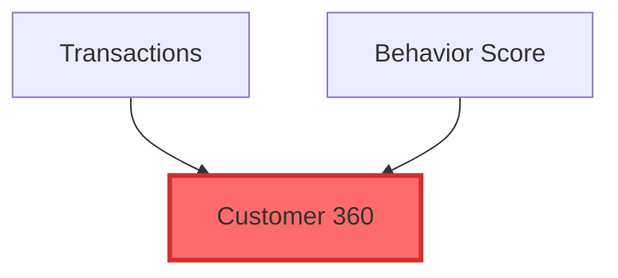

# ViewMapper - Architecture & Design Document

## Project Overview

**ViewMapper** is an intelligent Trino schema exploration tool that helps users navigate complex database schemas with thousands of views. It uses an LLM agent to provide guided exploration, preventing information overload by intelligently scoping diagrams and suggesting meaningful entry points.

**Key Value Proposition:** Unlike simple dependency mappers, ViewMapper acts as an intelligent guide that:
- Maps view dependencies based on SQL table/view references (not foreign keys)
- Assesses schema complexity before attempting visualization
- Suggests optimal starting points based on graph analysis
- Enables progressive disclosure through iterative exploration
- Generates focused, navigable dependency diagrams

## Critical Design Decisions

### 1. Java CLI + Python MCP Wrapper (Not Microservice)

**Decision:** Implement core logic as Java CLI, wrapped by lightweight Python MCP server.

**Rationale:**
- **Security:** No open ports, no network attack surface
- **Simplicity:** Single process model, easier installation
- **Portability:** JAR file + Python script = minimal dependencies
- **Testability:** Can test Java CLI independently via command line

**Architecture:**
```
┌──────────────────┐
│  Claude Desktop  │
└────────┬─────────┘
         │ stdio (JSON-RPC)
         ↓
┌──────────────────┐
│  Python MCP      │  ← ~235 lines, MCP protocol handling + context management
│  Server          │
└────────┬─────────┘
         │ subprocess
         ↓
┌──────────────────┐
│  Java CLI        │  ← Core logic: LangChain4j + Trino parser
│  (viewmapper)    │  ← Accepts JSON args, outputs JSON results
└──────────────────┘
```

### 2. Trino SQL Parser (Not Regex)

**Decision:** Use Trino's native SQL parser for dependency extraction.

**Critical Rationale:**
- Regex CANNOT handle: CTEs, subqueries, UNNEST, quoted identifiers, string literals
- False positives/negatives compound in large graphs (2,347 views = hundreds of errors)
- Dependency accuracy is MISSION-CRITICAL for the entire value proposition
- Trino parser is authoritative source of truth for Trino SQL

**Example of regex failure:**
```sql
WITH temp AS (
  SELECT * FROM schema1.table1
  WHERE description LIKE '%schema2.fake_table%'  -- Regex catches this!
)
SELECT * FROM temp
JOIN schema3.table2 ON temp.id = table2.id
```
- Regex returns: `[schema1.table1, schema2.fake_table, temp, schema3.table2]` ❌
- Trino parser returns: `[schema1.table1, schema3.table2]` ✅

### 3. LangChain4j Agent (Not Simple Tool Calling)

**Decision:** Use LangChain4j with agentic reasoning, not just API calls.

**Why Agent vs. Simple Tool:**
The agent provides intelligent guidance through multi-step reasoning:

1. **Complexity Assessment**
   - Analyzes schema size before attempting visualization
   - Decides if full diagram is feasible or guidance is needed

2. **Entry Point Suggestion**
   - Identifies high-impact views (most dependents)
   - Finds leaf views (final outputs/reports)
   - Locates central hubs (high betweenness centrality)

3. **Progressive Disclosure**
   - Extracts focused subgraphs based on user selections
   - Checks if subgraph is still too large
   - Suggests depth adjustments or alternative focuses

4. **Context Retention**
   - Maintains exploration state across turns
   - Enables coherent multi-turn conversations

**Agent Reasoning Flow:**
```
User: "Show me viewzoo.example schema"
  ↓
Agent: [Calls AnalyzeSchema tool]
  → Result: 2,347 views, VERY_COMPLEX
  ↓
Agent: [Recognizes too large, calls SuggestEntryPoints]
  → Result: customer_360_view (326 dependents), ...
  ↓
Agent: [Responds with suggestions]

User: "Focus on customer_360_view"
  ↓
Agent: [Calls ExtractSubgraph with depth=2 upstream, 1 downstream]
  → Result: 45 nodes
  ↓
Agent: [Checks if manageable, calls GenerateMermaid]
  → Returns diagram
```

## Technology Stack

### Java Components
- **Language:** Java 24
- **CLI Framework:** Picocli 4.7.5 (command-line argument parsing)
- **LLM Framework:** LangChain4j 0.35.0 with Anthropic integration
- **SQL Parser:** Trino Parser 478
- **Database Client:** Trino JDBC 478 (fully implemented)
- **JSON:** Jackson 2.16.1
- **Graph Analysis:** JGraphT 1.5.2 (fully integrated)
- **Build Tool:** Maven with Shade plugin (fat JAR)

### Python Components
- **MCP SDK:** `mcp` package (official Anthropic SDK)
- **Python Version:** 3.14

## Project Structure

```
viewmapper/
├── viewmapper-agent/
│   ├── pom.xml                                # Maven build with Shade plugin
│   ├── dependency-reduced-pom.xml             # Generated by Shade
│   ├── src/main/resources/datasets/           # Test data embedded in JAR
│   │   ├── README.md                          # Dataset documentation
│   │   ├── simple_ecommerce.json              # 11 views - SIMPLE
│   │   ├── moderate_analytics.json            # 35 views - MODERATE
│   │   ├── complex_enterprise.json            # 154 views - COMPLEX
│   │   └── realistic_bi_warehouse.json        # 86 views - COMPLEX
│   └── src/main/java/com/github/robfromboulder/viewmapper/
│       ├── Main.java                          # CLI entry point (Picocli)
│       ├── RunCommand.java                    # Primary CLI command
│       ├── parser/
│       │   ├── TrinoSqlParser.java            # Wraps Trino parser
│       │   ├── DependencyExtractor.java       # AST visitor
│       │   ├── TableReference.java            # Model for table references
│       │   └── DependencyAnalyzer.java        # Graph analysis (JGraphT)
│       └── agent/
│           ├── ViewMapperAgent.java           # LangChain4j orchestration
│           ├── AnthropicConfig.java           # API configuration
│           ├── types/
│           │   ├── ComplexityLevel.java       # SIMPLE/MODERATE/COMPLEX/VERY_COMPLEX
│           │   ├── SchemaComplexity.java      # Complexity analysis result
│           │   ├── EntryPointSuggestion.java  # Entry point recommendations
│           │   └── SubgraphResult.java        # Subgraph extraction result
│           └── tools/
│               ├── AnalyzeSchemaToolExecutor.java
│               ├── SuggestEntryPointsToolExecutor.java
│               ├── ExtractSubgraphToolExecutor.java
│               └── GenerateMermaidToolExecutor.java
│
├── viewmapper-mcp-server/         # Python MCP wrapper (fully implemented)
│   ├── pyproject.toml
│   ├── mcp_server.py              # ~235 lines, subprocess wrapper + context management
│   └── tests/
│       └── test_mcp_server.py     # Unit tests with mocked subprocess
│
├── README.md                      # User documentation
└── ARCHITECTURE.md                # This document
```

**Current Implementation Status:**
- ✅ Java CLI with Picocli: Fully implemented
- ✅ SQL Parser (Trino 478): Fully implemented with comprehensive tests
- ✅ Graph Analysis (JGraphT): Fully implemented (high-impact, leaf, centrality, subgraph)
- ✅ LangChain4j Agent: Fully implemented with 4 tool executors
- ✅ Dataset Loading: JSON embedded in JAR with test:// connection URLs
- ✅ Trino JDBC Connection: Fully implemented with elegant catalog handling
- ✅ Python MCP Wrapper: Fully implemented with context management

**Simplified Design Changes:**
- ❌ Removed `SchemaExplorationService` - unnecessary layer between RunCommand and ViewMapperAgent
- ❌ Removed `ExplorationResult` wrapper - direct String responses from agent
- ❌ Removed `ExplorationContext` - agent maintains context internally via LangChain4j
- ✅ Direct architecture: `RunCommand → ViewMapperAgent → Tool Executors → DependencyAnalyzer`

## Core Components

### 1. TrinoSqlParser (Java)

**Purpose:** Accurately extract table/view dependencies from SQL.

**Key Implementation:**
```java
public class TrinoSqlParser {
    private final SqlParser parser = new SqlParser();
    
    public Set<QualifiedName> extractDependencies(String sql) {
        Statement statement = parser.createStatement(sql);
        DependencyVisitor visitor = new DependencyVisitor();
        statement.accept(visitor, null);
        return visitor.getDependencies();
    }
}

// AST Visitor to walk parsed SQL
class DependencyVisitor extends DefaultTraversalVisitor<Void, Void> {
    private Set<QualifiedName> dependencies = new HashSet<>();
    
    @Override
    protected Void visitTable(Table node, Void context) {
        dependencies.add(node.getName());
        return super.visitTable(node, context);
    }
    
    // Handle CTEs, subqueries, etc. properly
}
```

### 2. JDBC Connection & Schema Loading (Java)

**Purpose:** Load view definitions from live Trino databases.

**Connection URL Format:**
```
jdbc:trino://host:port?user=username            # Recommended: Multi-catalog
jdbc:trino://host:port/catalog?user=username    # Advanced: Single catalog
```

**Design Decision: Multi-Catalog First, Elegant Catalog Handling**
- **Recommended - URL without catalog:** Schema parameter must be qualified (e.g., `viewzoo.example`)
  - Enables multi-catalog exploration in single session
  - Reduces configuration complexity ("which catalog was that?")
  - LLM extracts catalog and schema from user query
- **Advanced - URL with catalog:** Schema parameter must be simple name (e.g., `analytics`)
  - Conversation is "bound" to that catalog for regulatory/compliance requirements
  - Prevents accidentally querying other catalogs in enterprise environments

**Key Implementation (RunCommand.java:118-164):**
```java
private void loadFromJdbc(DependencyAnalyzer analyzer, String jdbcUrl, String schemaName) throws Exception {
    try (Connection conn = DriverManager.getConnection(jdbcUrl)) {
        String urlCatalog = conn.getCatalog();
        String catalog, schema;

        // Catalog validation
        if (urlCatalog != null && !urlCatalog.isEmpty()) {
            if (schemaName.contains(".")) throw new IllegalArgumentException(...);
            catalog = urlCatalog;
            schema = schemaName;
        } else {
            if (!schemaName.contains(".")) throw new IllegalArgumentException(...);
            String[] parts = schemaName.split("\\.", 2); // First period only
            catalog = parts[0];
            schema = parts[1];
        }

        // When session catalog is not set, use fully-qualified information_schema reference
        String infoSchemaTable = (urlCatalog != null && !urlCatalog.trim().isEmpty())
                ? "information_schema.views"
                : catalog + ".information_schema.views";

        // Query for all views and their SQL definitions
        if (verbose) System.err.println("Querying for infoSchemaTable: " + infoSchemaTable +
                                        ", catalog: " + catalog + ", schema: " + schema);
        String sql = "SELECT table_name, view_definition FROM " + infoSchemaTable +
                     " WHERE table_catalog = ? AND table_schema = ? ORDER BY table_name";

        try (PreparedStatement stmt = conn.prepareStatement(sql)) {
            stmt.setString(1, catalog);
            stmt.setString(2, schema);
            try (ResultSet rs = stmt.executeQuery()) {
                boolean empty = true;
                while (rs.next()) {
                    String viewName = rs.getString("table_name");
                    String viewSql = rs.getString("view_definition");
                    String fullyQualifiedName = catalog + "." + schema + "." + viewName;
                    analyzer.addView(fullyQualifiedName, viewSql);
                    empty = false;
                }
                if (empty) throw new IllegalArgumentException("No views found in " + catalog + "." + schema);
            }
        }
    }
}
```

**Design Rationale:**
- No separate connection manager classes (YAGNI principle)
- Let JDBC driver handle URL parsing and validation
- Single SQL query (not N+1 queries) for efficiency
- Try-with-resources for automatic cleanup
- Clear error messages guide user to correct usage

**MCP Integration:**
- LLM receives tool schema with `schema` parameter
- Description guides LLM to use `catalog.schema` format
- Java validation provides helpful errors if format mismatches configuration

**Example Flows:**

1. **Multi-catalog URL (recommended for MCP):**
   - Config: `VIEWMAPPER_CONNECTION="jdbc:trino://host:8080?user=username"`
   - User: "show me viewzoo.example"
   - LLM: `--schema viewzoo.example`
   - Result: ✅ Works! Extracts catalog=viewzoo, schema=example

2. **CLI usage (multi-catalog, recommended):**
   ```bash
   java -jar viewmapper.jar run \
     --connection "jdbc:trino://host:8080?user=username" \
     --schema viewzoo.example \
     "Show me dependencies"
   ```

3. **Single-catalog URL (advanced - enterprise/regulatory):**
   - Config: `VIEWMAPPER_CONNECTION="jdbc:trino://host:8080/production?user=username"`
   - User: "show me viewzoo.example"
   - LLM: `--schema viewzoo.example`
   - Result: ❌ Error: "Connection is bound to catalog 'production'. Use simple schema name."
   - User adjusts: "show me analytics"
   - LLM: `--schema analytics`
   - Result: ✅ Works! Uses catalog=production, schema=analytics

4. **CLI usage (single-catalog, advanced):**
   ```bash
   java -jar viewmapper.jar run \
     --connection "jdbc:trino://host:8080/production?user=username" \
     --schema analytics \
     "Show me dependencies"
   ```

### 3. DependencyAnalyzer (Java)

**Purpose:** Build and analyze dependency graph.

**Key Methods:**
```java
public class DependencyAnalyzer {
    private DirectedGraph<String, DefaultEdge> graph;

    // Add views to graph (from test datasets or JDBC)
    public void addView(String viewName, String sql);

    // Analyze graph structure
    public Map<String, Integer> findHighImpactViews();
    public List<String> findLeafViews();
    public Map<String, Double> calculateCentrality();

    // Extract focused subgraph
    public Set<String> findSubgraph(
        String focusView,
        int depthUpstream,
        int depthDownstream,
        int maxNodes
    );
}
```

### 4. ViewMapperAgent (Java)

**Purpose:** LangChain4j-powered agent orchestration with embedded system prompt.

**Key Implementation:**
```java
public class ViewMapperAgent {
    private final Assistant assistant;  // AiServices proxy

    // Default constructor (uses environment config)
    public ViewMapperAgent(DependencyAnalyzer analyzer) {
        this(analyzer, AnthropicConfig.fromEnvironment());
    }

    // Explicit config constructor
    public ViewMapperAgent(DependencyAnalyzer analyzer, AnthropicConfig config) {
        ChatLanguageModel model = AnthropicChatModel.builder()
            .apiKey(config.getApiKey())
            .modelName(config.getModelName())
            .timeout(config.getTimeout())
            .build();

        this.assistant = AiServices.builder(Assistant.class)
            .chatLanguageModel(model)
            .tools(
                new AnalyzeSchemaToolExecutor(analyzer),
                new SuggestEntryPointsToolExecutor(analyzer),
                new ExtractSubgraphToolExecutor(analyzer),
                new GenerateMermaidToolExecutor(analyzer)
            )
            .build();
    }

    // Main entry point
    public String chat(String userQuery) {
        return assistant.chat(userQuery);
    }

    // Embedded interface with system prompt
    interface Assistant {
        @SystemMessage("You are a database schema expert...")
        String chat(String userMessage);
    }
}
```

**Design Note:** Removed SchemaExplorationService layer - RunCommand now uses ViewMapperAgent directly.

### 5. System Prompt Strategy

**Purpose:** Provide reasoning capabilities to guide exploration.

**Agent Prompt Strategy:**
```
You are a database schema expert helping users explore complex dependency graphs.

REASONING STRATEGY:
1. Always assess complexity first (call AnalyzeSchema)
2. If SIMPLE (<20 views): Generate full diagram
3. If MODERATE (20-100): Suggest grouping
4. If COMPLEX/VERY_COMPLEX (>100): Guide user to entry points
5. When user selects focus: Extract subgraph with appropriate depth
6. If still too large: Suggest narrowing scope
7. Maintain context across conversation

Available tools:
- AnalyzeSchema: Count views, assess complexity
- SuggestEntryPoints: Find high-impact/leaf/hub views
- ExtractSubgraph: Get focused dependency graph
- GenerateMermaid: Create diagram from subgraph
```

### 6. Python MCP Wrapper

**Purpose:** Handle MCP protocol, delegate to Java CLI, manage conversation context.

**Implementation:**
- Register single tool: `explore_trino_views`
- On tool call: Execute Java CLI via subprocess
- Maintain conversation history (3-turn window)
- Build enhanced prompts with context
- Return text output directly (includes Mermaid diagrams)

## Graph Analysis Algorithms

### Complexity Assessment
```
SIMPLE: <20 views          → Full diagram
MODERATE: 20-100 views     → Suggest grouping
COMPLEX: 100-500 views     → Require focus
VERY_COMPLEX: 500+ views   → Guided exploration
```

### Entry Point Identification

1. **High-Impact Views** (by out-degree)
   - Sort views by number of dependents
   - Top 5 = most widely used

2. **Leaf Views** (zero out-degree)
   - No dependents = likely final outputs/reports
   - Good for "what are the end results?"

3. **Central Hubs** (by betweenness centrality)
   - Views that connect many upstream to many downstream
   - Key integration points

### Subgraph Extraction

```java
Set<String> extractSubgraph(String focus, int upDepth, int downDepth) {
    Set<String> upstream = bfs(focus, Direction.INCOMING, upDepth);
    Set<String> downstream = bfs(focus, Direction.OUTGOING, downDepth);
    return union(upstream, downstream, {focus});
}
```

## Mermaid Generation

**Output Format:**


**Styling Rules:**
- Focus view: Red/bold border
- Upstream dependencies: Blue
- Downstream dependents: Green
- Tables vs. views: Different shapes

## Build & Release Process

### Version Numbering Convention

**Local Development:**
- Local builds always use version `478` (e.g., `viewmapper:478`)
- This is the version built by `./build.sh`
- Never used in public repositories or documentation

**Public Releases:**
- Public releases use `478` + lowercase letter (e.g., `478a`, `478b`, `478c`)
- Format: `robfromboulder/viewmapper-mcp-server:478c`
- **IMPORTANT:** Never use the `latest` tag
  - `latest` creates ambiguity and unpredictable caching behavior
  - All references (docs, configs, examples) must use explicit version tags
  - Users must always specify exact version to pull/run

### Build Scripts

The project includes three automated scripts at the root level:

**1. `./clean.sh` - Remove all build artifacts**
```bash
./clean.sh
```

Removes:
- `viewmapper-agent/target/` - Maven build output (29M)
- `viewmapper-agent/dependency-reduced-pom.xml` - Maven Shade artifact
- `viewmapper-mcp-server/venv/` - Python virtual environment (75M)
- `viewmapper-mcp-server/__pycache__/` - Python bytecode cache
- `viewmapper-mcp-server/viewmapper-478.jar` - Copied JAR (27M)
- `viewmapper-mcp-server/.pytest_cache/` - Pytest cache
- Docker image `viewmapper:478` (~457M)
- Docker build cache and system cache

Result: Project reduces from ~134M to ~3M (source code only)

**2. `./build.sh` - Build local development version**
```bash
./build.sh
```

Steps:
1. Checks prerequisites (Maven, Docker, Java)
2. Builds viewmapper-agent JAR with `mvn clean package`
3. Copies JAR to viewmapper-mcp-server directory
4. Builds Docker container `viewmapper:478` with `--no-cache`
5. Provides color-coded progress output and build summary

**3. `./release.sh <version>` - Release to DockerHub**
```bash
./release.sh 478c
```

Steps:
1. Validates version format (must be `478[a-z]`)
2. Verifies git working directory is clean (no uncommitted changes)
3. Runs `./clean.sh` to ensure fresh build
4. Runs `./build.sh` to create artifacts
5. Builds and pushes multi-platform Docker image:
   - Platforms: `linux/amd64`, `linux/arm64`
   - Tag: `robfromboulder/viewmapper-mcp-server:478c`
   - Includes SBOM and provenance metadata
   - Uses `docker buildx` with `--no-cache`
6. Creates annotated git tag `v478c`
7. Pushes git tag to origin
8. Displays summary with next steps

**Note:** When run via Claude Code, you'll be prompted to approve the `git push` command before it executes, providing a final checkpoint.

### Manual Build (For Debugging)

If you need fine-grained control or want to diagnose a specific build step:

```bash
cd viewmapper-agent
mvn clean package
cd ../viewmapper-mcp-server
cp ../viewmapper-agent/target/viewmapper-478.jar .
docker image rm -f viewmapper:478 && docker build --no-cache -t viewmapper:478 .
```

### Claude Desktop Configuration (Docker - Production)

**Recommended: Multi-catalog configuration with published release:**
```json
{
  "mcpServers": {
    "viewmapper-mcp-server": {
      "command": "docker",
      "args": [
        "run", "-i", "--rm",
        "-e", "ANTHROPIC_API_KEY_FOR_VIEWMAPPER=sk-ant-...",
        "-e", "VIEWMAPPER_CONNECTION=jdbc:trino://trino.example.com:8080?user=youruser",
        "robfromboulder/viewmapper-mcp-server:478c"
      ]
    }
  }
}
```

**For testing with sample data with published release:**
```json
{
  "mcpServers": {
    "viewmapper-mcp-server": {
      "command": "docker",
      "args": [
        "run", "-i", "--rm",
        "-e", "ANTHROPIC_API_KEY_FOR_VIEWMAPPER=sk-ant-...",
        "-e", "VIEWMAPPER_CONNECTION=test://simple_ecommerce",
        "robfromboulder/viewmapper-mcp-server:478c"
      ]
    }
  }
}
```

**For local development with local build:**
```json
{
  "mcpServers": {
    "viewmapper-mcp-server": {
      "command": "docker",
      "args": [
        "run", "-i", "--rm",
        "-e", "ANTHROPIC_API_KEY_FOR_VIEWMAPPER=sk-ant-...",
        "-e", "VIEWMAPPER_CONNECTION=test://simple_ecommerce",
        "viewmapper:478"
      ]
    }
  }
}
```

### Development Setup (Local Python)

For developers making changes to the MCP server:

```bash
# 1. build Java CLI
cd viewmapper-agent
mvn clean package
# Produces: target/viewmapper-478.jar

# 2. set up Python MCP
cd ../viewmapper-mcp-server
cp ../viewmapper-agent/target/viewmapper-478.jar .
python3.14 -m venv venv
source venv/bin/activate
pip install -e ".[dev]"  # install with dev dependencies (includes pytest)
```

### Claude Desktop Configuration (Development)
```json
{
  "mcpServers": {
    "viewmapper-mcp-server": {
      "command": "/absolute/path/to/viewmapper/viewmapper-mcp-server/venv/bin/python",
      "args": ["mcp_server.py"],
      "cwd": "/absolute/path/to/viewmapper/viewmapper-mcp-server",
      "env": {
        "ANTHROPIC_API_KEY_FOR_VIEWMAPPER": "sk-...",
        "VIEWMAPPER_CONNECTION": "test://simple_ecommerce",
        "VIEWMAPPER_JAR": "/absolute/path/to/viewmapper-agent/target/viewmapper-478.jar"
      }
    }
  }
}
```

## Testing Strategy

### Unit Tests (Java)
- SQL parsing accuracy (include edge cases: CTEs, UNNEST, quoted identifiers)
- Graph algorithms (BFS, centrality calculations)
- Mermaid generation

### Integration Tests
- Full Java CLI execution with test schemas
- Verify JSON output format

### MCP Tests (Python)
- Tool registration and schema validation (3 tests)
- Prompt building with conversation history (5 tests)
- Tool execution with mocked subprocess (9 tests)
- Error handling and timeout scenarios
- Context management across turns

### End-to-End
- ✅ Execute with test datasets via CLI
- ✅ Execute with live Trino via JDBC
- ✅ Execute via Claude Desktop with MCP
- ✅ Verify interactive exploration flow

## Success Metrics

### Functional
- ✅ Correctly parses all Trino SQL syntax
- ✅ Identifies meaningful entry points
- ✅ Generates accurate dependency graphs
- ✅ Handles schemas with 1000+ views
- ✅ Connects to live Trino databases via JDBC
- ✅ Supports both catalog-bound and multi-catalog configurations

### User Experience
- ✅ Agent suggests next steps intelligently
- ✅ Progressive disclosure prevents overwhelm
- ✅ Diagrams are readable (20-50 nodes max)
- ✅ Context maintained across conversation

### Portfolio Value
- ✅ Demonstrates agentic reasoning (not just tool calling)
- ✅ Shows polyglot architecture skills
- ✅ Solves real problem (schema exploration at scale)
- ✅ Production-quality SQL parsing

## Future Enhancements

1. **Column-Level Lineage:** Track column dependencies within views
2. **Interactive Diagrams:** Export React Flow components for web embedding
3. **Caching:** Cache parsed dependency graphs to avoid re-parsing
4. **Cross-Catalog Dependencies:** Track dependencies that span multiple catalogs
5. **Performance Metrics:** Annotate views with query statistics from Trino
6. **Export Formats:** SVG, PNG, GraphML for external tools
7. **Connection Pooling:** For high-frequency JDBC usage (currently stateless)

## Key References

- **Trino SQL Parser:** https://trino.io/docs/current/develop/sql-parser.html
- **LangChain4j:** https://github.com/langchain4j/langchain4j
- **MCP Protocol:** https://modelcontextprotocol.io/
- **Picocli:** https://picocli.info/
- **Graph Algorithms:** Cormen et al., "Introduction to Algorithms" (BFS, centrality)

## Interview Talking Points

1. **Why not regex for SQL parsing?**
   - "Regex fails on CTEs, subqueries, and edge cases"
   - "For 2,347 views, errors compound exponentially"
   - "Trino parser is authoritative source of truth"

2. **Why Java + Python hybrid?**
   - "Python MCP SDK: rapid protocol implementation (40 lines)"
   - "Java: native Trino parser, type safety, performance"
   - "Right tool for each job"

3. **Why CLI over microservice?**
   - "Desktop tool: no need for persistent service"
   - "Security: no open ports"
   - "Simplicity: single subprocess call"

4. **What makes this agentic?**
   - "Not just executing tools - reasoning about problem space"
   - "Assesses complexity, suggests strategy, guides user"
   - "Progressive disclosure based on graph analysis"

5. **How does JDBC catalog handling work?**
   - "Multi-catalog by default: recommended for easier configuration and broader exploration"
   - "Read-only tool makes multi-catalog exploration safe by design"
   - "Single-catalog mode available for enterprise/regulatory requirements"
   - "Elegant validation: URL format determines schema parameter expectations"
   - "Single SQL query using information_schema - efficient and simple"
   - "LLM guidance via MCP tool schema steers toward catalog.schema format"
   - "No over-engineering: let JDBC driver handle URL parsing, no connection manager classes"
