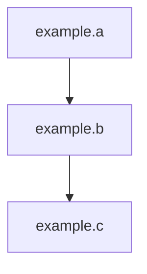

# viewmapper
This Claude-based agent helps you discover and map relationships between Trino views, even for schemas with thousands of views or deeply nested hierarchies.

[](https://claude.ai/code)
[](https://github.com/robfromboulder/viewmapper/blob/main/CONTRIBUTING.md)
[](https://github.com/robfromboulder/viewmapper/blob/main/LICENSE)

Let's say you have a simple view hierarchy like this:
```sql
create or replace view example.b as select * from example.a
create or replace view example.c as select * from example.b
```

That's a lot of reading as the schema grows to hundreds of views. And because these views aren't related by foreign keys, many ERD tools don't properly report these relationships. ☹️

ViewMapper uses the Trino parser to properly report on all view relationships, even when using complex JOIN, UNION, or WITH clauses in your view definitions.
With its understanding of view relationships, ViewMapper can easily render this hierarchy into a Mermaid diagram:

