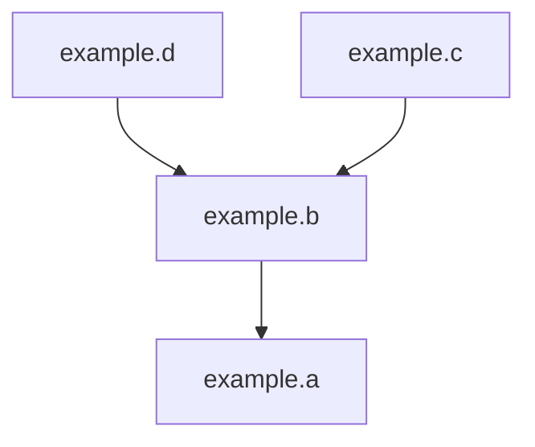
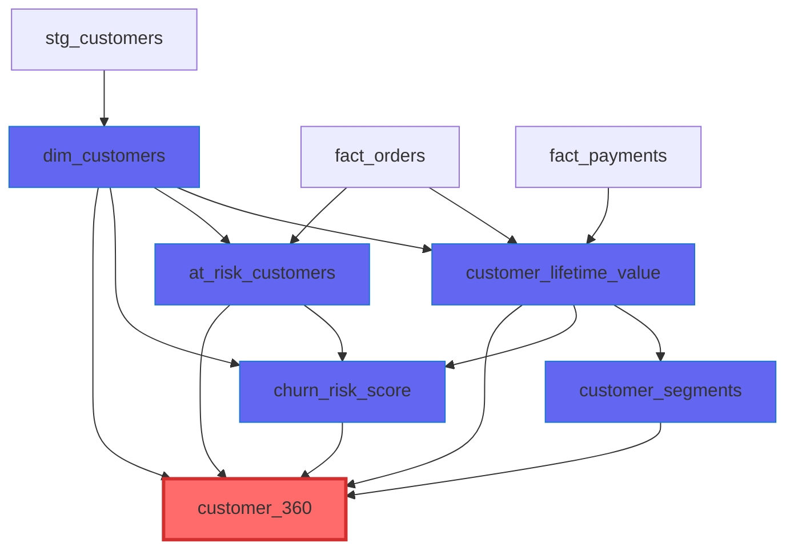

# viewmapper
This Claude-based agent helps you discover and map relationships between Trino views, even for schemas with hundreds of views or deeply nested hierarchies.
You can use this agent from the command line, from other Java programs, or as an MCP server directly from Claude Desktop, which also natively renders
the Mermaid diagrams generated by this agent.

[](https://claude.ai/code)
[](https://github.com/robfromboulder/viewmapper/blob/main/CONTRIBUTING.md)
[](https://github.com/robfromboulder/viewmapper/blob/main/LICENSE)


## Required Software

* [Anthropic API Key](https://console.anthropic.com/) (for accessing the Claude API at runtime)
* [Claude Desktop](https://claude.ai/download) (for calling the agent and displaying Mermaid diagrams)
* [Docker](https://docs.docker.com/engine/install/), [Docker Desktop for Mac](https://docs.docker.com/desktop/setup/install/mac-install/), or [Docker Desktop for Windows](https://docs.docker.com/desktop/setup/install/windows-install/) (for MCP server runtime)
* [Trino](https://trino.io), [Starburst Enterprise](https://starburst.io) or [Starburst Galaxy](https://starburst.io) (for views to explore/visualize)

> [!IMPORTANT]
> You don't have to configure Java, Maven, Python, or other development tools, unless making contributions.

## Mapping View Hierarchies

Let's say you have a simple Trino view hierarchy like this:
```sql
create or replace view example.b as select * from example.a
create or replace view example.c as select * from example.b
create or replace view example.d as select * from example.b
```

Even this simple example requires some careful reading to understand. As we start building more complex hierarchies, it becomes more difficult to track
relationships between views. Traditional ERD tools focus on foreign key relationships between tables, but because view hierarchies don't use foreign
keys, these SQL-level dependencies aren't visualized by most ERD tools. ☹️

ViewMapper solves this by using the Trino SQL parser to extract and map these view-to-view dependencies, creating an accurate graph of relationships even for
views with multiple JOIN, UNION, or WITH clauses. If your schema is small, like the example above, it can generate a diagram in one shot.
> Please generate a mermaid diagram file for the example schema


For larger schemas, you can ask ViewMapper to focus on relationships around a specific view.
> Please generate a mermaid diagram file for the example schema, focusing on customer_360


For very large or complex schemas, ViewMapper will (intelligently) refuse to show all views in a single (unreadable) diagram
and will suggest views to focus upon instead:
* **high-impact views** (with highest number of dependencies)
* **central-hub views** (with highest centrality among consumers)
* **leaf views** (final views with no dependents)

## Configuring Claude Desktop

### 1. Enable developer mode in **Help | Troubleshooting**

### 2. Click on **Settings | Developer** and then click **Edit Config**

### 3. Edit `claude_desktop_config.json` and add a new server

**For connecting to a remote Trino server:**
```json
  "mcpServers": {
    "viewmapper-mcp-server": {
      "command": "docker",
      "args": [
        "run", "-i", "--rm",
        "-e", "ANTHROPIC_API_KEY=sk-ant-...",
        "-e", "VIEWMAPPER_CONNECTION=jdbc:trino://trino.example.com:8080/catalog?user=youruser",
        "robfromboulder/viewmapper-mcp-server:478b"
      ]
    }
  }
```

**For connecting to Trino running on your local machine:**
```json
  "mcpServers": {
    "viewmapper-mcp-server": {
      "command": "docker",
      "args": [
        "run", "-i", "--rm",
        "-e", "ANTHROPIC_API_KEY=sk-ant-...",
        "-e", "VIEWMAPPER_CONNECTION=jdbc:trino://host.docker.internal:8080/catalog?user=youruser",
        "robfromboulder/viewmapper-mcp-server:478b"
      ]
    }
  }
```

**For testing with predefined sample data:**
```json
  "mcpServers": {
    "viewmapper-mcp-server": {
      "command": "docker",
      "args": [
        "run", "-i", "--rm",
        "-e", "ANTHROPIC_API_KEY=sk-ant-...",
        "-e", "VIEWMAPPER_CONNECTION=test://simple_ecommerce",
        "robfromboulder/viewmapper-mcp-server:478b"
      ]
    }
  }
```

> [!IMPORTANT]
> **JDBC URL Format:** `jdbc:trino://hostname:port/catalog?user=username` or `jdbc:trino://hostname:port?user=username`
> - The **catalog** in the URL is optional. If omitted, you must specify catalog when querying (e.g., `viewzoo.example` instead of just `example`)
> - The **user** parameter is required
> - For local connections, use `host.docker.internal` instead of `localhost` so the Docker container can reach your host machine
> - The `claude_desktop_config.json` file must be valid JSON

### 4. Restart Claude Desktop or click **Developer | Reload MCP Configuration**

> [!TIP]
> A single named MCP server container (with a unique name) will be launched by Claude Desktop, and terminated when Claude Desktop shuts down.
> You should not ever have to start or stop the MCP server manually.

### 5. Verify the MCP server is running properly

> [!IMPORTANT]
> Check **Settings | Developer** to see if the local MCP server is in the "running" state.

### 6. Start a new chat and ask about views

* How many views are in the viewzoo.example schema?
* Analyze the viewzoo.example schema and give me a summary
* What view in the viewzoo.example schema has the most dependents?
* What are the leaf views in the viewzoo.example schema?
* Show me a mermaid diagram file of the entire viewzoo.example schema
* Show me a mermaid diagram file of all viewzoo.example views related to 'customer_360'
* Show me a mermaid diagram file from 3 levels upstream and 2 levels downstream from 'cust_summary'

## Limitations

* **Alpha quality software** - ViewMapper is in active testing and development and may contain bugs or unexpected behavior. Please open a [GitHub issue](https://github.com/robfromboulder/viewmapper/issues) if you encounter a problem or need help.
* **LLM-generated analysis** - Like all LLM-based tools, ViewMapper can produce incorrect conclusions or miss important details. All results should be reviewed and verified by qualified staff before making decisions based on the analysis.
* **Claude models only** - Currently works exclusively with Anthropic's Claude models. Adding support for Ollama models isn't terribly difficult, but these models are generally less capable than Claude, and would require a lot of additional testing time.
* **Diagram rendering** - To see Mermaid diagrams rendered visually in Claude Desktop, ask for a "mermaid diagram file" explicitly. Otherwise Claude Desktop may show you the diagram source code instead.
* **Limited conversation history** - The agent remembers only the last 3 turns of conversation. For complex explorations, you may need to start a new chat.

## Troubleshooting

### MCP server not appearing in Claude Desktop

* Verify your `claude_desktop_config.json` is valid JSON with no syntax errors.
* Check **Settings | Developer** to see if the MCP server shows as "running".
* Click **Developer | Reload MCP Configuration** after making changes.
* Restart Claude Desktop completely.

### MCP server tools not available in chat

* Ensure tool permissions are enabled in **Settings | Security & Privacy**.
* Check **Developer | Open MCP Log File** to review detailed error messages.
* Verify your Docker installation is working properly by running `docker ps` in a terminal.

### Connection errors to Trino

**"No views found" or empty schema errors**
* Verify the schema name matches your Trino configuration
* For JDBC URLs with catalog: Use simple schema name like `analytics`
* For JDBC URLs without catalog: Use qualified schema like `viewzoo.analytics`
* Use a Trino client to verify views exist: `SHOW SCHEMAS FROM catalog;` and `SHOW TABLES FROM catalog.schema;`

**"Authentication failed" or "User must be specified"**
* Your JDBC URL is missing the required `user` parameter
* Fix: Add `?user=youruser` to your JDBC URL

**"Connection refused" when connecting to localhost**
* Docker containers can't reach `localhost` on the host machine
* Fix: Use `host.docker.internal` instead of `localhost` in your JDBC URL
* Example: `jdbc:trino://host.docker.internal:7700/memory?user=youruser`

**Other connection issues:**
* Verify your credentials and network access to the Trino server
* Try the test connection first: `test://simple_ecommerce`
* Check the MCP logs via **Developer | Open MCP Log File** for detailed error messages

### Diagrams showing as text instead of rendering

* Ask explicitly for a "mermaid diagram file" rather than just "diagram" or "visualization".
* Claude Desktop will automatically render `.mmd` files as visual diagrams.
